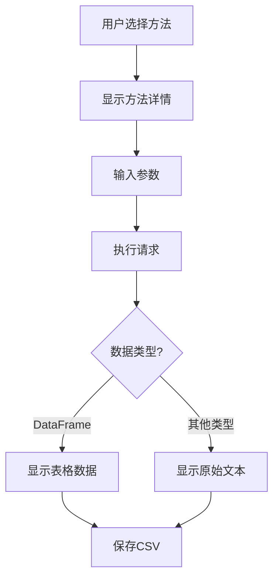

# AKShare数据加载器 - 技术设计文档

## 1. 系统架构
- **技术栈**：
  - Python 3.13+
  - PyQt5 (GUI框架)
  - AKShare (金融数据接口)
  - pandas (数据处理)
- **架构模式**：MVC模式
  - Model: AKShare数据接口 + pandas数据处理
  - View: PyQt5 UI组件
  - Controller: MainWindow类中的事件处理

## 2. 核心模块设计

### 2.1 主窗口模块 (`MainWindow`)
```python
class MainWindow(QMainWindow):
    def __init__(self):
        super().__init__()
        self.initUI()  # 初始化界面
        self.load_excel_data()  # 加载配置数据
        self.createMenuBar()  # 创建菜单系统
```

### 2.2 数据加载模块
```python
def load_excel_data(self):
    # 加载AKShare方法配置
    df = pd.read_excel('config/akshare_method_doc.xlsx')
    # 处理并显示方法列表
```

### 2.3 方法执行模块
```python
def execute_akshare_request(self):
    # 获取当前方法名和参数
    method = getattr(ak, self.current_method_name)
    # 执行AKShare请求
    self.current_result = method(**params)
```

### 2.4 菜单系统模块
```python
def createMenuBar(self):
    # 从operation_menu.xlsx加载配置
    # 动态生成菜单结构
    for level2, items in self.menu_config.items():
        sub_menu = operation_menu.addMenu(level2)
```

## 3. 关键类说明

### 3.1 `MainWindow` - 主窗口类
| 方法 | 功能 |
|------|------|
| `initUI()` | 初始化主界面布局 |
| `create_left_panel()` | 创建左侧方法选择面板 |
| `create_right_panel()` | 创建右侧结果显示面板 |
| `show_method_details()` | 显示选中方法的详细信息 |

### 3.2 `ToolTipWindow` - 工具提示类
```python
class ToolTipWindow(QLabel):
    def showText(self, pos, text, timeout=15000):
        # 显示带超时的工具提示
```

### 3.3 `MethodListWidget` - 方法列表控件
```python
class MethodListWidget(QListWidget):
    def keyPressEvent(self, event: QKeyEvent) -> None:
        # 处理键盘导航事件
```

## 4. 数据处理流程


## 5. 配置文件结构

### 5.1 `akshare_method_doc.xlsx`
| 列名 | 说明 |
|------|------|
| 分类 | 方法所属类别 |
| 方法 | AKShare方法名 |
| 解释 | 方法功能说明 |
| 参数 | 参数列表（分号分隔） |
| 注释 | 额外说明（显示为tooltip） |

### 5.2 `operation_menu.xlsx`
| 列名 | 说明 |
|------|------|
| Level2 | 主菜单名称 |
| Level3 | 子菜单名称 |
| akmethod | 执行的方法字符串 |
| file_path | 数据保存路径 |
| save_column | 需要保存的列（列表格式） |

## 6. 异常处理机制
- **文件加载异常**：捕获并显示友好错误信息
- **方法执行异常**：显示详细错误堆栈
- **菜单配置异常**：跳过无效配置项
- **文件保存异常**：提供详细错误信息

## 7. 性能优化
- **延迟加载**：只在需要时加载配置数据
- **缓存机制**：缓存已加载的方法数据
- **异步操作**：使用QTimer处理耗时操作